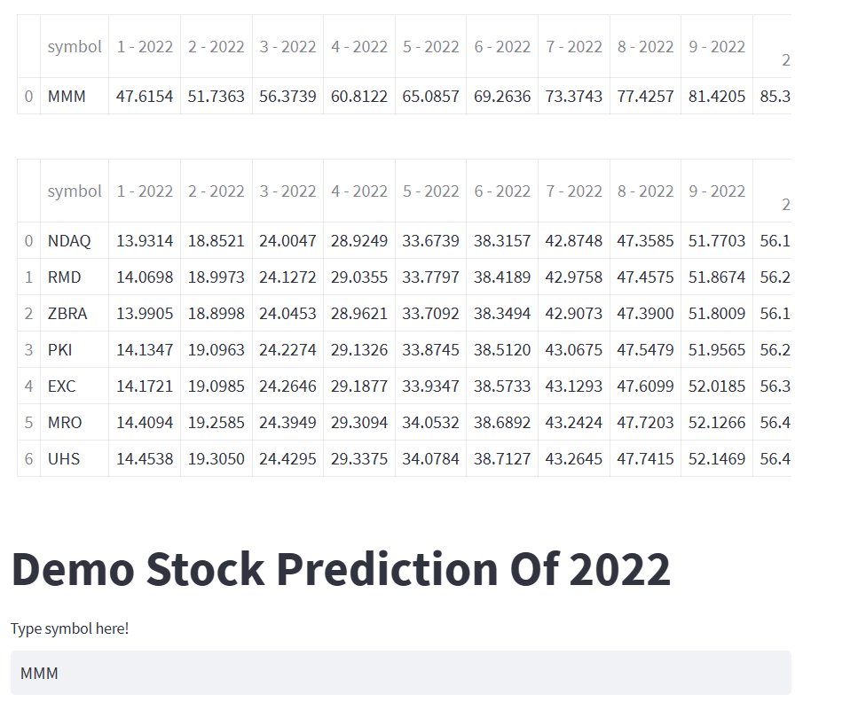

# Stock Price Prediction

You can look my training steps is in training.ipynb.
For testing my app just run
```
python3 api.py
python3 app.py
```
Look at the app in http://localhost:8501/
Type in your symbol and choose top N symbol then predict


The result is 2 table of the chosen symbol prices and top N grow rate prices in 2022

